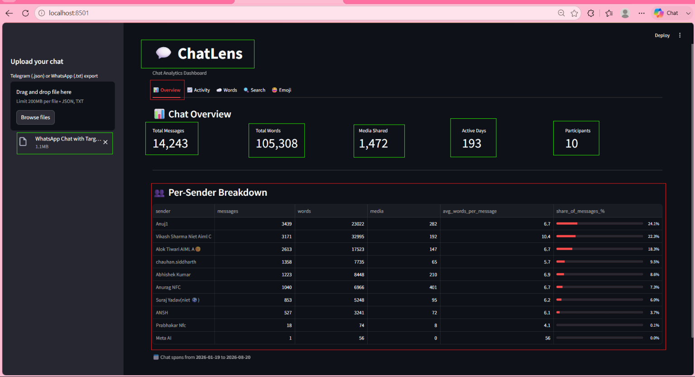
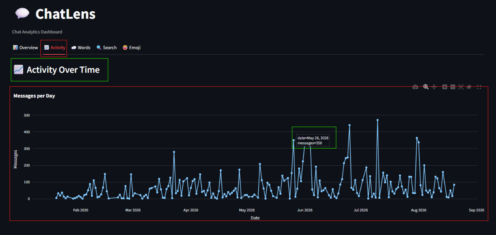
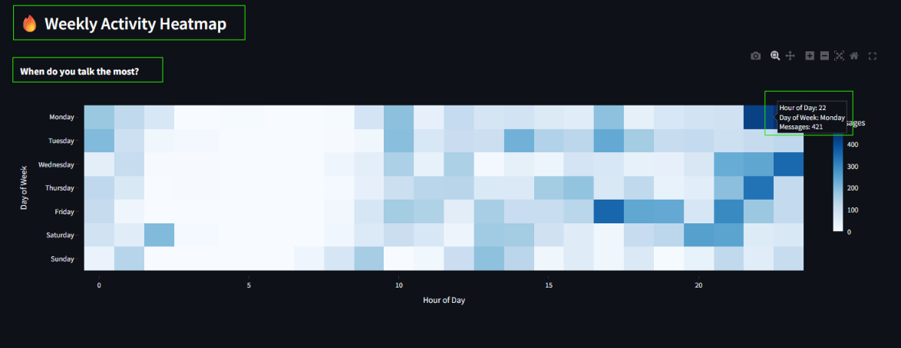
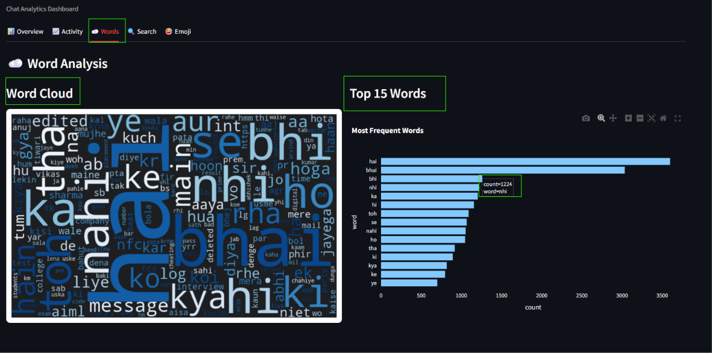
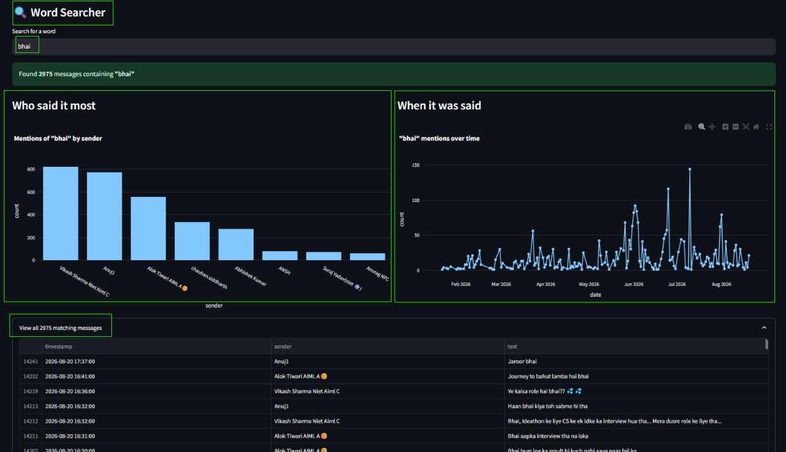
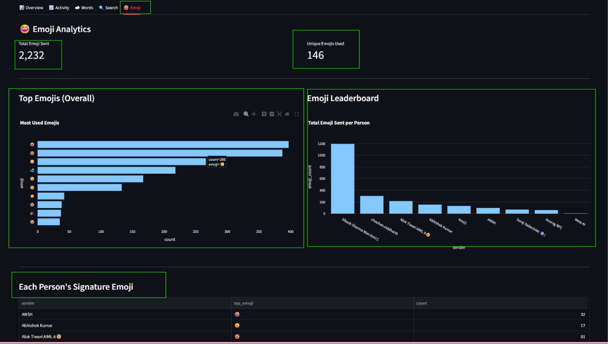

<div align="center">

# 💬 ChatLens — Chat Analytics Dashboard

<p><strong>Turn your conversations into patterns, peaks, and personality.</strong></p>

<p>
     <a href="https://github.com/Abhishekkumar071/ChatLens"></a>
     <a href="https://streamlit.io/"></a>
     <a href="https://github.com/Abhishekkumar071/ChatLens/blob/main/LICENSE"></a>
</p>

</div>

**ChatLens** turns your exported Telegram or WhatsApp chat history into an interactive analytics dashboard — message trends, activity heatmaps, word clouds, a word search engine, and emoji leaderboards. Everything runs **locally**: your chat data is parsed and analyzed on your own machine and never sent to any external server.

<p align="center">
     <a href="#-features">Features</a> ·
     <a href="#-preview">Preview</a> ·
     <a href="#-how-to-export-your-chats">Export chats</a> ·
     <a href="#-installation--setup">Run locally</a> ·
     <a href="#-running-tests">Tests</a>
</p>

---

## 🖼️ Preview

<p align="center">
     <a href="outPut_Image/overView_HomePage.png">
          
     </a>
</p>

<details>
<summary><strong>Explore every analytics view</strong> · click to expand</summary>

<table>
     <tr>
          <td align="center" width="50%"><a href="outPut_Image/activityOvertimeGraph.png"></a><br><sub>Activity over time</sub></td>
          <td align="center" width="50%"><a href="outPut_Image/activityByday%26hour.png"></a><br><sub>Activity by day and hour</sub></td>
     </tr>
     <tr>
          <td align="center"><a href="outPut_Image/weekendActivityHeatmap.png"></a><br><sub>Weekly activity heatmap</sub></td>
          <td align="center"><a href="outPut_Image/wordAnanlysis.png"></a><br><sub>Word analysis</sub></td>
     </tr>
     <tr>
          <td align="center"><a href="outPut_Image/wordSercher.png"></a><br><sub>Word searcher</sub></td>
          <td align="center"><a href="outPut_Image/emojisAnalysis.png"></a><br><sub>Emoji analytics</sub></td>
     </tr>
</table>
</details>

---

## ✨ Features

### 📊 Overview
Headline stats at a glance — total messages, words, media shared, active days, and participants — plus a per-sender breakdown showing who talks the most, average words per message, and share of conversation.

### 📈 Activity Timeline
- Daily message-volume trend line
- Hour-of-day activity distribution
- A day-of-week × hour **heatmap** — see exactly when you talk the most (late-night weekdays? Sunday mornings?)

### ☁️ Word Analysis
NLP-powered word frequency analysis using NLTK stopword filtering — cutting out noise words to surface the words that actually define your conversations. Includes a visual word cloud and a top-15 frequency bar chart.

### 🔍 Word Searcher
Search any word and instantly see who said it most, and a timeline of exactly when it was said across your chat history.

### 😂 Emoji Analytics
Extracts and counts every emoji used, showing overall top emojis, a per-person emoji leaderboard, and each participant's "signature emoji."

---

## 🏗️ Architecture

ChatLens is built as a modular pipeline rather than a single script:

```
Raw Export (.json / .txt)
        │
        ▼
   parsers/          →  Platform-specific parsing (Telegram JSON / WhatsApp TXT)
        │                Outputs validated Message objects (Pydantic)
        ▼
   processing/        →  Feature engineering: word counts, timestamps,
                          emoji extraction — one shared enriched DataFrame
        ▼
   ui/                →  Five independent tab modules, each consuming
                          the same DataFrame (Overview, Activity, Words,
                          Search, Emoji)
        ▼
   app.py             →  Thin orchestration layer — upload handling,
                          session state, tab routing
```

**Why this matters:** parsing logic, data validation, and UI rendering are fully decoupled. Adding support for a new chat platform means writing one new parser — nothing else in the app changes.

---

## 🛠️ Tech Stack

| Layer | Tools |
|---|---|
| UI / Framework | [Streamlit](https://streamlit.io/) |
| Data Validation | [Pydantic](https://docs.pydantic.dev/) |
| Data Processing | [Pandas](https://pandas.pydata.org/) |
| Visualization | [Plotly](https://plotly.com/python/), [WordCloud](https://github.com/amueller/word_cloud), Matplotlib |
| NLP | [NLTK](https://www.nltk.org/) |
| Emoji Parsing | [emoji](https://pypi.org/project/emoji/) |
| Testing | [pytest](https://pytest.org/) |

---

## 📥 How to Export Your Chats

### 📱 Telegram (Desktop)
1. Open Telegram Desktop → go to the chat you want to analyze.
2. Click the three dots (top right) → **Export chat history**.
3. Uncheck all media types (keeps the file small).
4. Under "Format", select **Machine-readable JSON**.
5. Export and upload the resulting `result.json` file to the app.

### 🟢 WhatsApp (Mobile)
1. Open WhatsApp → go to the chat → tap the contact/group name.
2. Scroll down → tap **Export Chat**.
3. Choose **Without Media**.
4. Save the `.txt` file and upload it to the app.

---

## 🚀 Installation & Setup

```bash
# 1. Clone the repository
git clone https://github.com/Abhishekkumar071/ChatLens.git

cd ChatLens

# 2. Create and activate a virtual environment
python -m venv .venv
.venv\Scripts\activate        # Windows
# source .venv/bin/activate   # macOS / Linux

# 3. Install dependencies
pip install -r requirements.txt

# 4. Run the app
streamlit run app.py
```

The dashboard opens automatically at `http://localhost:8501`.

---

## 🧪 Running Tests

```bash
pytest -v
```

Parsers and the preprocessing pipeline are covered with a `pytest` suite using synthetic fixture files (no real chat data required to run tests).

---

## 📂 Project Structure

```
ChatLens/
├── app.py                  # Entry point — upload handling & tab routing
├── models.py                # Message data model (Pydantic)
├── parsers/
│   ├── telegram.py          # Telegram JSON parser
│   └── whatsapp.py          # WhatsApp TXT parser (multi-line, regional dates)
├── processing/
│   └── enrich.py            # Feature engineering pipeline
├── ui/
│   ├── overview.py
│   ├── activity.py
│   ├── words.py
│   ├── search.py
│   └── emoji_tab.py
├── tests/                   # pytest suite + fixtures
├── .streamlit/
│   └── config.toml          # Dark theme configuration
├── requirements.txt
└── pytest.ini
```

---

## 🔮 Future Scope

The core dashboard (upload → parse → 5 analytics tabs) is complete and fully tested. Planned next steps:

- [ ] **Caching & Performance** — `st.cache_data` wiring, stress-tested against 50k+ message chats
- [ ] **Error Handling & Security** — graceful handling of malformed files, upload limits, input sanitization
- [ ] **Dockerization** — containerized deployment
- [ ] **CI/CD Pipeline** — automated lint + test on every push (GitHub Actions)
- [ ] **Production Deployment** — live hosted demo (Streamlit Community Cloud)
- [ ] **Polish** — expanded docs, contribution guide, and (potential) AI-powered chat summarization

---

## 💻 Privacy

ChatLens runs entirely on your local machine. No chat data is ever uploaded to an external server, logged, or stored beyond your current browser session.

---

## 📝 License

MIT License — free to use, modify, and build on.

---

<p align="center">Built with ❤️ — a chat analytics dashboard, from scratch to production.<br>⭐ Star this repo if you find it useful!</p>
